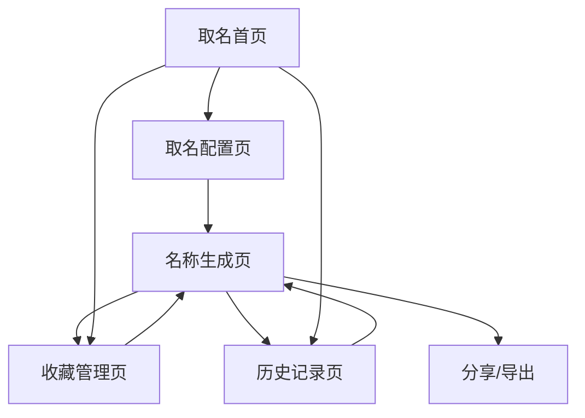

# AI取名模块产品需求文档

## 1. 产品概述

AI取名模块是算命网站的核心功能扩展，通过集成先进的AI技术为用户提供个性化的取名服务。该模块结合传统文化内涵与现代AI智能，为用户生成富有寓意的姓名、公司名、产品名等。

模块支持多种取名风格和类型选择，提供智能推荐和个性化定制服务，同时具备完善的收藏管理和历史记录功能。

目标是打造最专业、最智能的在线取名平台，传承中华文化精髓的同时满足现代用户的个性化需求。

## 2. 核心功能

### 2.1 用户角色

| 角色 | 注册方式 | 核心权限 |
|------|----------|----------|
| 游客用户 | 无需注册 | 可体验基础取名功能，每日限制3次 |
| 注册用户 | 邮箱注册 | 可使用完整取名功能、保存收藏、查看历史记录 |
| VIP用户 | 付费升级 | 享受高级取名算法、无限次数、专属风格、优先支持 |

### 2.2 功能模块

我们的AI取名模块包含以下核心页面：

1. **取名首页**：取名类型选择、风格展示、快速入口
2. **取名配置页**：详细需求输入、参数设置、风格定制
3. **名称生成页**：AI生成结果展示、名称解析、操作选项
4. **收藏管理页**：收藏名称列表、分类管理、批量操作
5. **历史记录页**：取名历史查看、记录搜索、数据统计

### 2.3 页面详情

| 页面名称 | 模块名称 | 功能描述 |
|----------|----------|----------|
| 取名首页 | 类型选择区 | 提供人名、公司名、产品名、店铺名等取名类型选择 |
| 取名首页 | 风格展示区 | 展示古典、现代、诗意、简约等不同取名风格 |
| 取名首页 | 快速入口 | 提供一键取名、智能推荐等快捷功能 |
| 取名配置页 | 基础信息输入 | 收集姓氏、性别、出生信息、行业类型等基础数据 |
| 取名配置页 | 需求定制 | 设置字数要求、寓意偏好、避讳字符、风格选择 |
| 取名配置页 | 高级选项 | VIP用户专享的五行配置、音律要求、文化内涵等 |
| 名称生成页 | 结果展示 | 显示AI生成的多个名称选项，包含评分和排序 |
| 名称生成页 | 名称解析 | 提供每个名称的寓意解释、五行分析、音律评价 |
| 名称生成页 | 操作选项 | 支持收藏、分享、重新生成、详细分析等功能 |
| 收藏管理页 | 收藏列表 | 显示用户收藏的所有名称，支持分类和标签管理 |
| 收藏管理页 | 分类管理 | 创建自定义分类，如"备选人名"、"公司候选"等 |
| 收藏管理页 | 批量操作 | 支持批量删除、导出、分享等批量管理功能 |
| 历史记录页 | 记录列表 | 显示用户的取名历史，包含时间、类型、结果等信息 |
| 历史记录页 | 搜索筛选 | 支持按时间、类型、关键词等条件筛选历史记录 |
| 历史记录页 | 数据统计 | 展示用户的取名偏好、使用频率等数据分析 |

## 3. 核心流程

**游客用户流程：**
用户访问取名首页 → 选择取名类型 → 输入基础信息 → 查看生成结果 → 注册保存收藏

**注册用户流程：**
用户登录 → 选择取名类型和风格 → 详细配置需求 → AI生成名称 → 查看解析 → 收藏或重新生成

**VIP用户流程：**
VIP用户登录 → 使用高级配置选项 → 享受专属算法 → 获取深度解析 → 无限次生成 → 专业建议

## 4. 用户界面设计

### 4.1 设计风格

- **主色调**：继承网站深紫色(#2D1B69)和金色(#FFD700)，体现神秘与智慧
- **辅助色**：淡紫色(#E1BEE7)、浅金色(#FFF8DC)用于背景和辅助元素
- **按钮样式**：圆角渐变按钮，悬停时金色光晕效果，保持古风质感
- **字体设计**：标题使用仿宋体，名称展示使用楷体，正文使用微软雅黑
- **布局风格**：卡片式布局，采用对称美学，顶部导航配合面包屑导航
- **图标风格**：融入书法、印章、竹简等传统文化元素

### 4.2 页面设计概览

| 页面名称 | 模块名称 | UI元素 |
|----------|----------|--------|
| 取名首页 | 类型选择区 | 大型卡片布局，每种类型配有专属图标，悬停时紫金渐变效果 |
| 取名首页 | 风格展示区 | 横向滚动展示，每种风格配有示例名称和简短描述 |
| 取名配置页 | 信息输入区 | 分步骤表单设计，进度条显示，输入框采用古典边框样式 |
| 取名配置页 | 需求定制 | 标签选择器，滑块控件，颜色编码的选项分类 |
| 名称生成页 | 结果展示 | 网格布局展示名称，每个名称卡片包含评分星级和操作按钮 |
| 名称生成页 | 名称解析 | 侧边栏或弹窗形式，包含寓意、五行、音律等多维度分析 |
| 收藏管理页 | 收藏列表 | 瀑布流布局，支持列表和卡片两种视图模式 |
| 历史记录页 | 记录列表 | 时间轴样式，每条记录显示缩略信息和快速操作 |

### 4.3 响应式设计

模块采用移动端优先的响应式设计，确保在各种设备上都有优秀的用户体验。移动端特别优化了名称选择和收藏操作，增大触摸区域，简化复杂配置流程。平板端提供分屏浏览模式，桌面端支持多窗口对比功能。