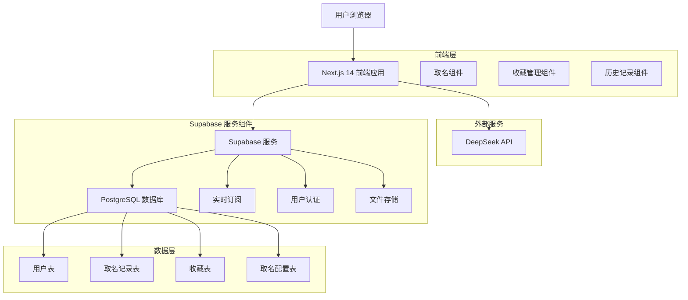
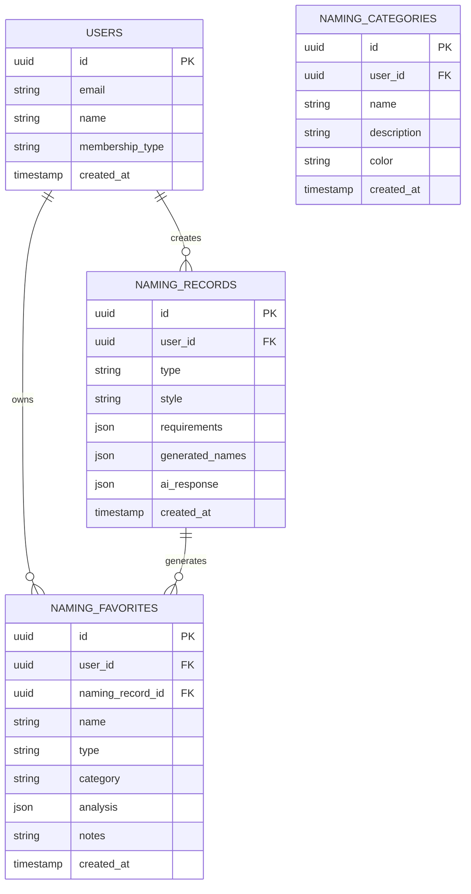

# AI取名模块技术架构文档

## 1. 架构设计



## 2. 技术描述

- **前端**: Next.js 14 + TypeScript + Tailwind CSS + Framer Motion
- **后端**: Supabase (PostgreSQL + 实时API + 认证)
- **AI服务**: DeepSeek API (中文文化理解 + 创意生成)
- **状态管理**: Zustand (轻量级状态管理)
- **UI组件**: Headless UI + 自定义组件库
- **部署**: Vercel (前端) + Supabase Cloud (后端)

## 3. 路由定义

| 路由 | 用途 |
|------|------|
| /naming | 取名模块首页，展示取名类型和风格选择 |
| /naming/configure | 取名配置页面，用户输入详细需求 |
| /naming/generate | 名称生成页面，显示AI生成的结果 |
| /naming/favorites | 收藏管理页面，管理用户收藏的名称 |
| /naming/history | 历史记录页面，查看用户的取名历史 |
| /api/naming/generate | API路由，调用AI生成名称 |
| /api/naming/analyze | API路由，分析名称的寓意和特征 |
| /api/naming/favorites | API路由，管理收藏功能 |
| /api/naming/history | API路由，获取历史记录 |

## 4. API定义

### 4.1 核心API

**AI取名生成**
```
POST /api/naming/generate
```

请求参数:
| 参数名 | 参数类型 | 是否必需 | 描述 |
|--------|----------|----------|------|
| type | string | true | 取名类型 (person/company/product/shop) |
| style | string | true | 取名风格 (classical/modern/poetic/simple) |
| surname | string | false | 姓氏 (仅人名类型需要) |
| gender | string | false | 性别 (male/female/neutral) |
| industry | string | false | 行业类型 (仅公司/产品名需要) |
| requirements | object | true | 具体需求配置 |
| requirements.length | number | false | 字数要求 (1-4) |
| requirements.meaning | array | false | 寓意偏好 ["success", "wisdom", "prosperity"] |
| requirements.avoidChars | array | false | 避讳字符 |
| requirements.includeChars | array | false | 必须包含的字符 |
| requirements.wuxing | string | false | 五行偏好 (metal/wood/water/fire/earth) |
| count | number | false | 生成数量 (默认10，VIP用户最多50) |

响应数据:
| 参数名 | 参数类型 | 描述 |
|--------|----------|------|
| success | boolean | 请求是否成功 |
| data | object | 生成结果 |
| data.names | array | 生成的名称列表 |
| data.names[].name | string | 名称文本 |
| data.names[].score | number | 综合评分 (1-100) |
| data.names[].meaning | string | 寓意解释 |
| data.names[].analysis | object | 详细分析 |
| data.names[].analysis.wuxing | object | 五行分析 |
| data.names[].analysis.phonetics | object | 音律分析 |
| data.names[].analysis.cultural | string | 文化内涵 |
| data.requestId | string | 请求ID，用于历史记录 |

示例请求:
```json
{
  "type": "person",
  "style": "classical",
  "surname": "李",
  "gender": "male",
  "requirements": {
    "length": 2,
    "meaning": ["wisdom", "success"],
    "wuxing": "water",
    "avoidChars": ["病", "死"]
  },
  "count": 10
}
```

**名称分析**
```
POST /api/naming/analyze
```

请求参数:
| 参数名 | 参数类型 | 是否必需 | 描述 |
|--------|----------|----------|------|
| name | string | true | 要分析的名称 |
| type | string | true | 名称类型 |
| context | object | false | 上下文信息 (姓氏、行业等) |

响应数据:
| 参数名 | 参数类型 | 描述 |
|--------|----------|------|
| success | boolean | 请求是否成功 |
| analysis | object | 分析结果 |
| analysis.score | number | 综合评分 |
| analysis.meaning | string | 寓意解释 |
| analysis.wuxing | object | 五行属性和平衡度 |
| analysis.phonetics | object | 音律和谐度 |
| analysis.cultural | string | 文化背景和典故 |
| analysis.suggestions | array | 改进建议 |

**收藏管理**
```
POST /api/naming/favorites
GET /api/naming/favorites
DELETE /api/naming/favorites/{id}
```

收藏名称请求参数:
| 参数名 | 参数类型 | 是否必需 | 描述 |
|--------|----------|----------|------|
| name | string | true | 名称文本 |
| type | string | true | 名称类型 |
| analysis | object | true | 分析结果 |
| category | string | false | 分类标签 |
| notes | string | false | 用户备注 |

获取收藏列表响应:
| 参数名 | 参数类型 | 描述 |
|--------|----------|------|
| success | boolean | 请求是否成功 |
| favorites | array | 收藏列表 |
| favorites[].id | string | 收藏ID |
| favorites[].name | string | 名称文本 |
| favorites[].type | string | 名称类型 |
| favorites[].category | string | 分类标签 |
| favorites[].analysis | object | 分析结果 |
| favorites[].notes | string | 用户备注 |
| favorites[].createdAt | string | 收藏时间 |

## 5. 数据模型

### 5.1 数据模型定义



### 5.2 数据定义语言

**取名记录表 (naming_records)**
```sql
-- 创建取名记录表
CREATE TABLE naming_records (
    id UUID PRIMARY KEY DEFAULT gen_random_uuid(),
    user_id UUID REFERENCES users(id) ON DELETE CASCADE,
    type VARCHAR(20) NOT NULL CHECK (type IN ('person', 'company', 'product', 'shop')),
    style VARCHAR(20) NOT NULL CHECK (style IN ('classical', 'modern', 'poetic', 'simple')),
    requirements JSONB NOT NULL, -- 用户输入的需求配置
    generated_names JSONB NOT NULL, -- AI生成的名称列表
    ai_response JSONB, -- 完整的AI响应数据
    request_count INTEGER DEFAULT 1, -- 生成次数
    created_at TIMESTAMP WITH TIME ZONE DEFAULT NOW(),
    updated_at TIMESTAMP WITH TIME ZONE DEFAULT NOW()
);

-- 创建索引
CREATE INDEX idx_naming_records_user_id ON naming_records(user_id);
CREATE INDEX idx_naming_records_type ON naming_records(type);
CREATE INDEX idx_naming_records_created_at ON naming_records(created_at DESC);
CREATE INDEX idx_naming_records_requirements ON naming_records USING GIN(requirements);
```

**收藏表 (naming_favorites)**
```sql
-- 创建收藏表
CREATE TABLE naming_favorites (
    id UUID PRIMARY KEY DEFAULT gen_random_uuid(),
    user_id UUID REFERENCES users(id) ON DELETE CASCADE,
    naming_record_id UUID REFERENCES naming_records(id) ON DELETE SET NULL,
    name VARCHAR(100) NOT NULL,
    type VARCHAR(20) NOT NULL,
    category VARCHAR(50) DEFAULT 'default',
    analysis JSONB, -- 名称分析结果
    notes TEXT, -- 用户备注
    is_starred BOOLEAN DEFAULT FALSE, -- 是否标星
    created_at TIMESTAMP WITH TIME ZONE DEFAULT NOW(),
    updated_at TIMESTAMP WITH TIME ZONE DEFAULT NOW()
);

-- 创建索引
CREATE INDEX idx_naming_favorites_user_id ON naming_favorites(user_id);
CREATE INDEX idx_naming_favorites_category ON naming_favorites(category);
CREATE INDEX idx_naming_favorites_type ON naming_favorites(type);
CREATE INDEX idx_naming_favorites_created_at ON naming_favorites(created_at DESC);
CREATE INDEX idx_naming_favorites_starred ON naming_favorites(is_starred) WHERE is_starred = TRUE;

-- 创建唯一约束，防止重复收藏
CREATE UNIQUE INDEX idx_naming_favorites_unique ON naming_favorites(user_id, name, type);
```

**分类表 (naming_categories)**
```sql
-- 创建分类表
CREATE TABLE naming_categories (
    id UUID PRIMARY KEY DEFAULT gen_random_uuid(),
    user_id UUID REFERENCES users(id) ON DELETE CASCADE,
    name VARCHAR(50) NOT NULL,
    description TEXT,
    color VARCHAR(7) DEFAULT '#2D1B69', -- 十六进制颜色值
    sort_order INTEGER DEFAULT 0,
    created_at TIMESTAMP WITH TIME ZONE DEFAULT NOW(),
    updated_at TIMESTAMP WITH TIME ZONE DEFAULT NOW()
);

-- 创建索引
CREATE INDEX idx_naming_categories_user_id ON naming_categories(user_id);
CREATE INDEX idx_naming_categories_sort_order ON naming_categories(sort_order);

-- 创建唯一约束，同一用户不能有重名分类
CREATE UNIQUE INDEX idx_naming_categories_unique ON naming_categories(user_id, name);
```

**权限设置**
```sql
-- 设置表权限
GRANT SELECT ON naming_records TO anon;
GRANT ALL PRIVILEGES ON naming_records TO authenticated;

GRANT SELECT ON naming_favorites TO anon;
GRANT ALL PRIVILEGES ON naming_favorites TO authenticated;

GRANT SELECT ON naming_categories TO anon;
GRANT ALL PRIVILEGES ON naming_categories TO authenticated;

-- 行级安全策略
ALTER TABLE naming_records ENABLE ROW LEVEL SECURITY;
ALTER TABLE naming_favorites ENABLE ROW LEVEL SECURITY;
ALTER TABLE naming_categories ENABLE ROW LEVEL SECURITY;

-- 用户只能访问自己的数据
CREATE POLICY "Users can only access their own naming records" ON naming_records
    FOR ALL USING (auth.uid() = user_id);

CREATE POLICY "Users can only access their own favorites" ON naming_favorites
    FOR ALL USING (auth.uid() = user_id);

CREATE POLICY "Users can only access their own categories" ON naming_categories
    FOR ALL USING (auth.uid() = user_id);
```

## 6. 集成方案

### 6.1 与现有系统集成

- **用户系统集成**: 复用现有的Supabase用户认证系统
- **导航集成**: 在主导航中添加"AI取名"入口
- **样式集成**: 继承现有的设计系统和主题配置
- **数据共享**: 与用户中心、历史记录等模块数据互通

### 6.2 AI服务集成

- **API封装**: 创建统一的AI服务调用接口
- **错误处理**: 实现重试机制和降级策略
- **缓存策略**: 对常见请求结果进行缓存优化
- **监控告警**: 集成API调用监控和异常告警

### 6.3 性能优化

- **前端优化**: 使用React.memo和useMemo优化渲染性能
- **数据库优化**: 合理设计索引和查询优化
- **缓存策略**: 实现多层缓存机制
- **CDN加速**: 静态资源使用CDN分发