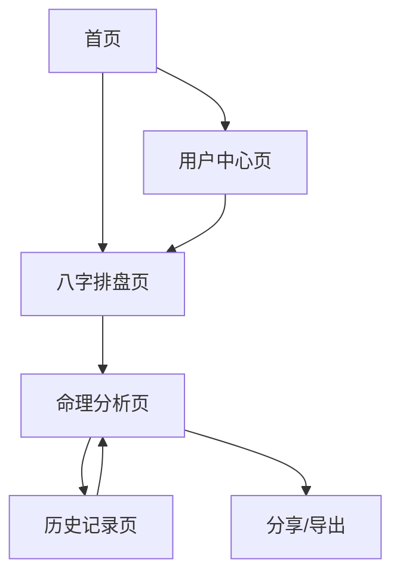

# 传统算命网站产品需求文档

## 1. 产品概述

本项目旨在打造一个融合传统命理文化与现代AI技术的专业算命网站，为用户提供基于八字理论的命理分析服务。

产品通过严格的传统命理算法结合AI智能分析，为用户提供准确的八字排盘、五行分析和命理解读，同时考虑真太阳时等传统因素的影响。

目标是成为最专业、最准确的在线命理分析平台，传承和弘扬中华传统文化。

## 2. 核心功能

### 2.1 用户角色

| 角色 | 注册方式 | 核心权限 |
|------|----------|----------|
| 游客用户 | 无需注册 | 可进行基础八字排盘和简单分析 |
| 注册用户 | 邮箱注册 | 可保存算命记录、查看历史分析、获得详细解读 |
| VIP用户 | 付费升级 | 享受高级命理分析、专业建议、优先客服支持 |

### 2.2 功能模块

我们的算命网站包含以下核心页面：

1. **首页**：品牌展示区、功能导航、用户登录入口
2. **八字排盘页**：出生信息输入、真太阳时计算、八字生成
3. **命理分析页**：五行分析、格局判断、运势解读
4. **历史记录页**：个人算命历史、收藏管理、数据导出
5. **用户中心页**：个人信息管理、会员升级、设置选项

### 2.3 页面详情

| 页面名称 | 模块名称 | 功能描述 |
|----------|----------|----------|
| 首页 | 品牌展示区 | 展示网站Logo、品牌理念，营造神秘古风氛围 |
| 首页 | 功能导航 | 提供八字排盘、命理分析等核心功能入口 |
| 首页 | 用户登录入口 | 用户注册、登录、找回密码功能 |
| 八字排盘页 | 出生信息输入 | 收集用户姓名、性别、出生年月日时、出生地点 |
| 八字排盘页 | 真太阳时计算 | 根据出生地理位置计算真太阳时，确保时辰准确性 |
| 八字排盘页 | 八字生成 | 生成天干地支组合，显示年柱、月柱、日柱、时柱 |
| 命理分析页 | 五行分析 | 分析五行强弱、喜忌神、五行缺失情况 |
| 命理分析页 | 格局判断 | 判断命理格局类型，如正官格、财格等 |
| 命理分析页 | 运势解读 | 提供性格特点、事业财运、感情婚姻等方面分析 |
| 历史记录页 | 算命历史 | 显示用户历次算命记录，支持时间排序和搜索 |
| 历史记录页 | 收藏管理 | 用户可收藏重要分析结果，便于后续查看 |
| 历史记录页 | 数据导出 | 支持将算命结果导出为PDF或图片格式 |
| 用户中心页 | 个人信息管理 | 修改个人资料、头像上传、密码更改 |
| 用户中心页 | 会员升级 | VIP会员购买、权益说明、支付管理 |
| 用户中心页 | 设置选项 | 通知设置、隐私设置、主题切换 |

## 3. 核心流程

**游客用户流程：**
用户访问首页 → 点击八字排盘 → 输入出生信息 → 查看基础分析结果 → 注册获取完整功能

**注册用户流程：**
用户登录 → 八字排盘 → 获取详细命理分析 → 保存到历史记录 → 查看或分享结果

**VIP用户流程：**
VIP用户登录 → 享受高级分析功能 → 获取专业建议 → 导出精美报告 → 客服咨询支持

## 4. 用户界面设计

### 4.1 设计风格

- **主色调**：深紫色(#2D1B69)代表神秘与智慧，金色(#FFD700)象征尊贵与权威
- **辅助色**：深蓝色(#1A237E)、古铜色(#8D6E63)营造古典氛围
- **按钮样式**：圆角渐变按钮，具有古风质感和现代交互体验
- **字体设计**：标题使用仿宋体，正文使用微软雅黑，确保可读性
- **布局风格**：卡片式布局结合传统对称美学，顶部导航配合侧边栏设计
- **图标风格**：采用中国传统文化元素，如太极、八卦、祥云等图案

### 4.2 页面设计概览

| 页面名称 | 模块名称 | UI元素 |
|----------|----------|--------|
| 首页 | 品牌展示区 | 深紫色渐变背景，金色Logo，飘动祥云动画效果 |
| 首页 | 功能导航 | 半透明卡片设计，悬停时金色边框高亮，古风图标 |
| 八字排盘页 | 信息输入区 | 仿古卷轴样式表单，金色边框，日期选择器采用传统日历样式 |
| 八字排盘页 | 结果展示区 | 八卦图背景，天干地支以传统书法字体显示 |
| 命理分析页 | 分析结果 | 分栏布局，五行用对应颜色圆环图表示，文字解读配古典边框 |
| 历史记录页 | 记录列表 | 时间轴样式布局，每条记录如古代竹简样式 |
| 用户中心页 | 个人信息 | 简洁现代设计，保持古风色调，头像框采用圆形金边设计 |

### 4.3 响应式设计

网站采用移动端优先的响应式设计，确保在手机、平板、桌面端都有良好的用户体验。移动端特别优化触摸交互，增大按钮点击区域，简化复杂操作流程。