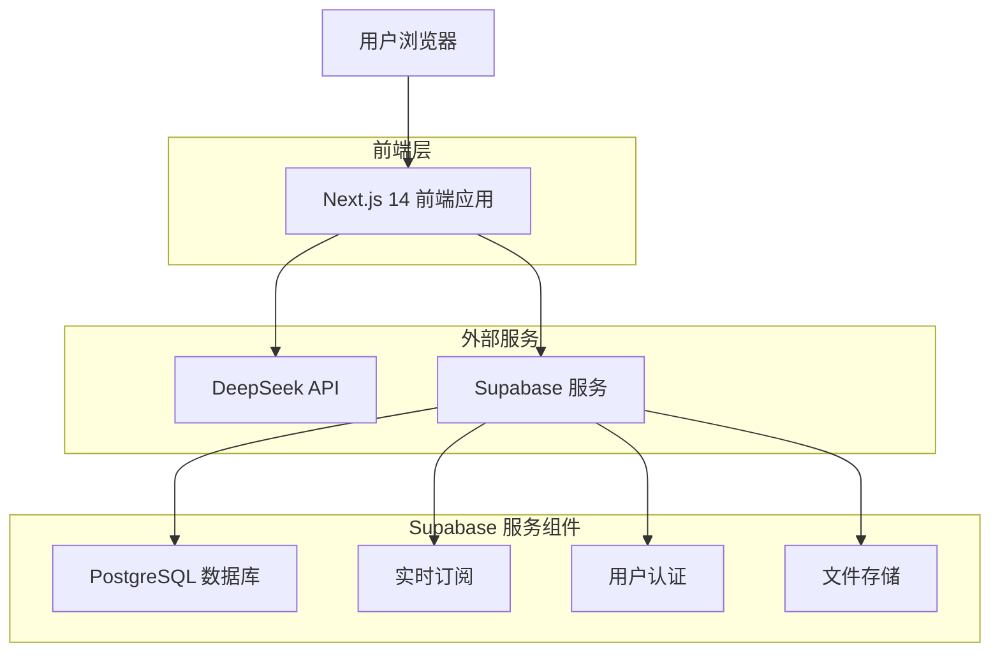
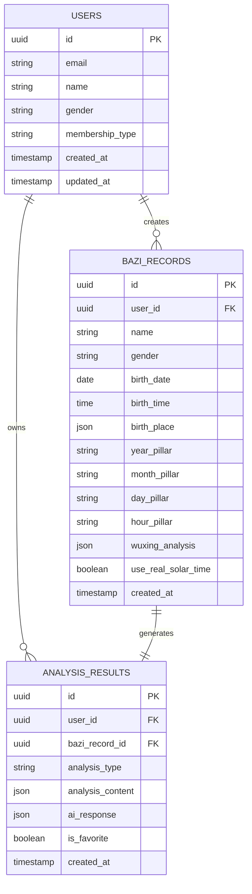

# 传统算命网站技术架构文档

## 1. 架构设计



## 2. 技术描述

- **前端**: Next.js 14 + TypeScript + Tailwind CSS + Framer Motion
- **后端**: Supabase (PostgreSQL + 实时API + 认证)
- **AI服务**: DeepSeek API (中文传统文化理解)
- **部署**: Vercel (前端) + Supabase Cloud (后端)

## 3. 路由定义

| 路由 | 用途 |
|------|------|
| / | 首页，展示品牌介绍和功能导航 |
| /bazi | 八字排盘页面，用户输入出生信息进行算命 |
| /analysis/[id] | 命理分析详情页，显示具体的算命结果 |
| /history | 历史记录页面，查看用户的算命历史 |
| /profile | 用户中心，个人信息管理和会员升级 |
| /auth/login | 用户登录页面 |
| /auth/register | 用户注册页面 |
| /api/bazi/calculate | API路由，处理八字计算逻辑 |
| /api/analysis/generate | API路由，调用DeepSeek生成命理分析 |

## 4. API定义

### 4.1 核心API

**八字计算相关**
```
POST /api/bazi/calculate
```

请求参数:
| 参数名 | 参数类型 | 是否必需 | 描述 |
|--------|----------|----------|------|
| name | string | true | 用户姓名 |
| gender | string | true | 性别 (male/female) |
| birthDate | string | true | 出生日期 (YYYY-MM-DD) |
| birthTime | string | true | 出生时间 (HH:mm) |
| birthPlace | object | true | 出生地点 {longitude, latitude, timezone} |
| useRealSolarTime | boolean | false | 是否使用真太阳时计算 |

响应数据:
| 参数名 | 参数类型 | 描述 |
|--------|----------|------|
| success | boolean | 请求是否成功 |
| data | object | 八字数据 |
| data.yearPillar | string | 年柱 (天干地支) |
| data.monthPillar | string | 月柱 (天干地支) |
| data.dayPillar | string | 日柱 (天干地支) |
| data.hourPillar | string | 时柱 (天干地支) |
| data.wuxing | object | 五行分析结果 |
| data.realSolarTime | string | 真太阳时 |

示例请求:
```json
{
  "name": "张三",
  "gender": "male",
  "birthDate": "1990-05-15",
  "birthTime": "14:30",
  "birthPlace": {
    "longitude": 116.4074,
    "latitude": 39.9042,
    "timezone": "Asia/Shanghai"
  },
  "useRealSolarTime": true
}
```

**AI命理分析相关**
```
POST /api/analysis/generate
```

请求参数:
| 参数名 | 参数类型 | 是否必需 | 描述 |
|--------|----------|----------|------|
| baziData | object | true | 八字计算结果 |
| analysisType | string | true | 分析类型 (basic/detailed/premium) |
| userInfo | object | true | 用户基本信息 |

响应数据:
| 参数名 | 参数类型 | 描述 |
|--------|----------|------|
| success | boolean | 请求是否成功 |
| analysis | object | AI分析结果 |
| analysis.personality | string | 性格特点分析 |
| analysis.career | string | 事业运势分析 |
| analysis.wealth | string | 财运分析 |
| analysis.relationship | string | 感情婚姻分析 |
| analysis.health | string | 健康运势分析 |
| analysis.suggestions | array | 改运建议 |

## 5. 数据模型

### 5.1 数据模型定义



### 5.2 数据定义语言

**用户表 (users)**
```sql
-- 创建用户表
CREATE TABLE users (
    id UUID PRIMARY KEY DEFAULT gen_random_uuid(),
    email VARCHAR(255) UNIQUE NOT NULL,
    name VARCHAR(100) NOT NULL,
    gender VARCHAR(10) CHECK (gender IN ('male', 'female')),
    membership_type VARCHAR(20) DEFAULT 'basic' CHECK (membership_type IN ('basic', 'vip', 'premium')),
    avatar_url TEXT,
    created_at TIMESTAMP WITH TIME ZONE DEFAULT NOW(),
    updated_at TIMESTAMP WITH TIME ZONE DEFAULT NOW()
);

-- 创建索引
CREATE INDEX idx_users_email ON users(email);
CREATE INDEX idx_users_membership ON users(membership_type);
```

**八字记录表 (bazi_records)**
```sql
-- 创建八字记录表
CREATE TABLE bazi_records (
    id UUID PRIMARY KEY DEFAULT gen_random_uuid(),
    user_id UUID REFERENCES users(id) ON DELETE CASCADE,
    name VARCHAR(100) NOT NULL,
    gender VARCHAR(10) NOT NULL,
    birth_date DATE NOT NULL,
    birth_time TIME NOT NULL,
    birth_place JSONB NOT NULL, -- {longitude, latitude, timezone, address}
    year_pillar VARCHAR(10) NOT NULL, -- 年柱
    month_pillar VARCHAR(10) NOT NULL, -- 月柱
    day_pillar VARCHAR(10) NOT NULL, -- 日柱
    hour_pillar VARCHAR(10) NOT NULL, -- 时柱
    wuxing_analysis JSONB, -- 五行分析结果
    use_real_solar_time BOOLEAN DEFAULT true,
    real_solar_time TIME, -- 真太阳时
    created_at TIMESTAMP WITH TIME ZONE DEFAULT NOW()
);

-- 创建索引
CREATE INDEX idx_bazi_records_user_id ON bazi_records(user_id);
CREATE INDEX idx_bazi_records_created_at ON bazi_records(created_at DESC);
CREATE INDEX idx_bazi_records_birth_date ON bazi_records(birth_date);
```

**分析结果表 (analysis_results)**
```sql
-- 创建分析结果表
CREATE TABLE analysis_results (
    id UUID PRIMARY KEY DEFAULT gen_random_uuid(),
    user_id UUID REFERENCES users(id) ON DELETE CASCADE,
    bazi_record_id UUID REFERENCES bazi_records(id) ON DELETE CASCADE,
    analysis_type VARCHAR(20) NOT NULL CHECK (analysis_type IN ('basic', 'detailed', 'premium')),
    analysis_content JSONB NOT NULL, -- 结构化分析结果
    ai_response TEXT, -- AI原始回复
    is_favorite BOOLEAN DEFAULT false,
    created_at TIMESTAMP WITH TIME ZONE DEFAULT NOW()
);

-- 创建索引
CREATE INDEX idx_analysis_results_user_id ON analysis_results(user_id);
CREATE INDEX idx_analysis_results_bazi_record_id ON analysis_results(bazi_record_id);
CREATE INDEX idx_analysis_results_created_at ON analysis_results(created_at DESC);
CREATE INDEX idx_analysis_results_favorite ON analysis_results(is_favorite) WHERE is_favorite = true;
```

**权限设置**
```sql
-- 为匿名用户授予基本读取权限
GRANT SELECT ON users TO anon;
GRANT SELECT ON bazi_records TO anon;
GRANT SELECT ON analysis_results TO anon;

-- 为认证用户授予完整权限
GRANT ALL PRIVILEGES ON users TO authenticated;
GRANT ALL PRIVILEGES ON bazi_records TO authenticated;
GRANT ALL PRIVILEGES ON analysis_results TO authenticated;
```

**初始化数据**
```sql
-- 插入测试用户数据
INSERT INTO users (email, name, gender, membership_type) VALUES
('test@example.com', '测试用户', 'male', 'basic'),
('vip@example.com', 'VIP用户', 'female', 'vip');
```